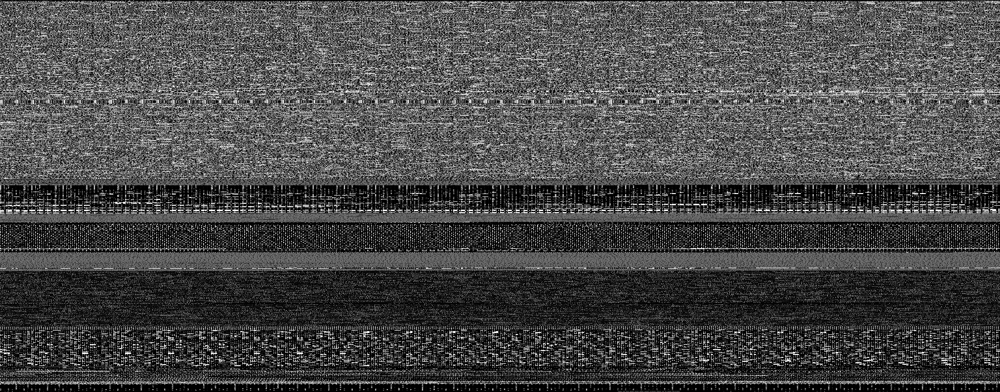

# go-print-file

A command-line utility that prints files as PNG images. Initially thought to
print itself (i.e, print the executable program file).

Example of an image generated:



### Building

To build (make and Go +1.17 required):

```bash
make build
```

### Usage

Usage of go-print-file:

```
Usage of go-print-file:
  -grow-h int
    	grow heigth in pixels
  -grow-w int
    	grow width in pixels
  -h int
    	heigth in pixels
  -h-ratio int
    	heigth ratio (default 1)
  -i string
    	input file, the executable itself by default
  -o string
    	output file
  -s int
    	skip leading bytes
  -w int
    	width in pixels
  -w-ratio int
    	width ratio (default 1)
```
